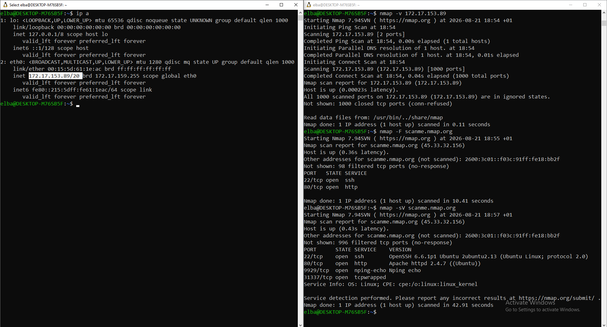
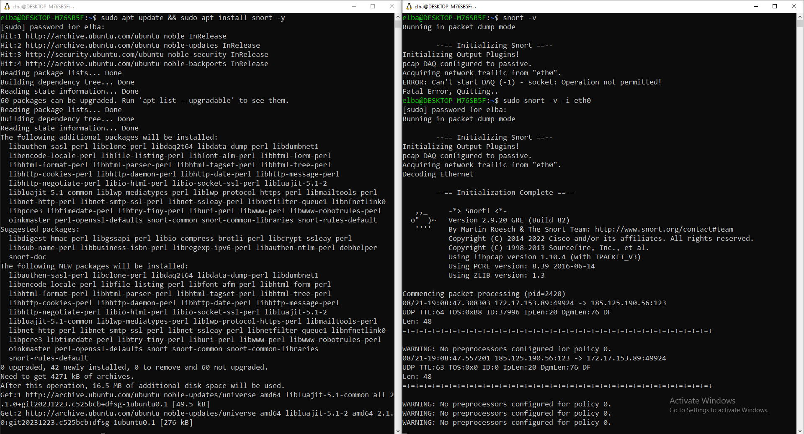
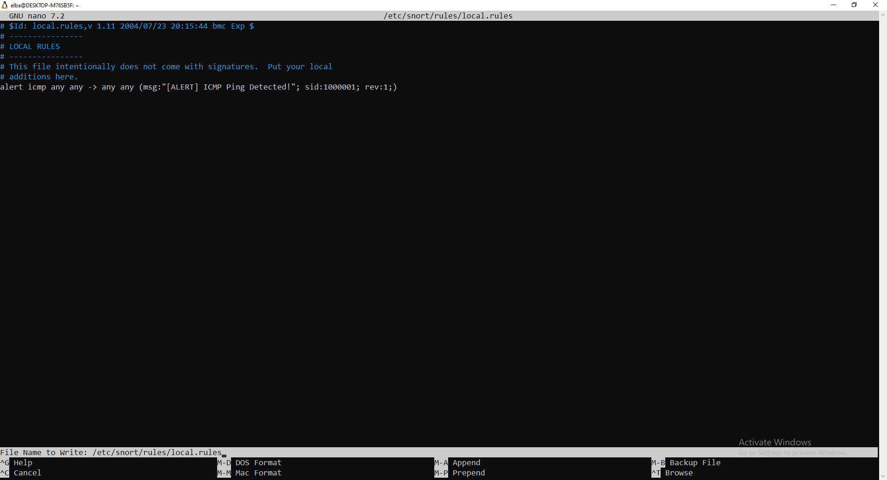
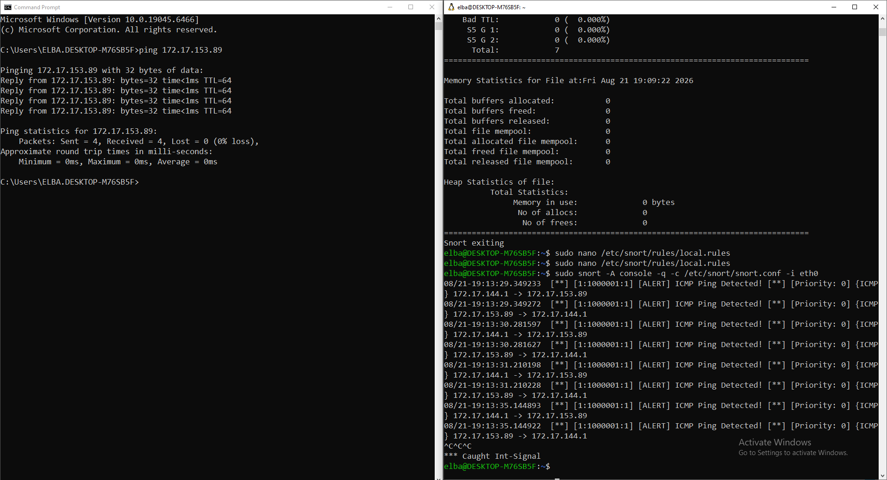

# Snort NIDS Threat Detection & Traffic Analysis Lab (WSL2)

## Project Overview
Deployed Snort 2.9 (NIDS) inside WSL2 Ubuntu to inspect virtual interface traffic (`eth0`), solve DAQ raw socket permissions, engineer custom rules, and analyze host-to-guest ICMP probes in real time.

---

## Lab Execution & Proof of Concept

### Phase 1: Network Reconnaissance & Interface Mapping
Identified the WSL2 virtual ethernet interface (`eth0`) and performed initial network reconnaissance using Nmap.

### Phase 2: Snort Installation & DAQ Socket Privilege Fix
Installed Snort NIDS on Ubuntu and elevated execution privileges (`sudo`) to resolve raw socket initialization errors (`Operation not permitted`).

### Phase 3: Custom Signature Authoring
Configured custom threat detection rule `sid:1000001` inside `/etc/snort/rules/local.rules` to detect ICMP probes.

### Phase 4: Threat Simulation & Live Alert Verification
Executed Snort in console alert mode (`sudo snort -A console -q -c /etc/snort/snort.conf -i eth0`) and verified real-time alert generation from Windows Host ping requests.

