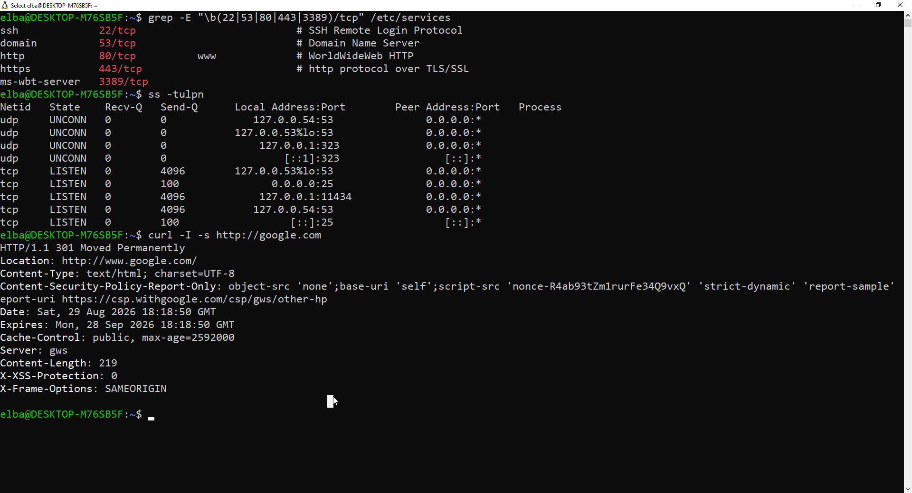

# Lab 02: Common Ports, Socket Auditing & Banner Grabbing

## Objective
Inspect active network ports, map transport layer protocols (TCP/UDP), and perform basic HTTP banner grabbing using Linux CLI tools.

## Visual Proof of Work

## Commands Executed
- `grep -E "\b(22|53|80|443|3389)/tcp" /etc/services`
- `ss -tulpn`
- `curl -I -s http://google.com`

## Key Findings & Troubleshooting
- **Here-Doc Fix:** Solved Bash command substitution error by single-quoting `'EOF'`, preventing execution of backticked code in Markdown strings.
- **Port Database Audit:** Verified standard port assignments for SSH (22), DNS (53), HTTP (80), HTTPS (443), and RDP (3389) via `/etc/services`.
- **Socket Analysis:** Identified listening TCP/UDP interfaces with `ss -tulpn`, confirming active bindings on local loopback addresses (`127.0.0.54:53`, `0.0.0.0:25`, `127.0.0.1:11434`).
- **Banner Inspection:** Parsed HTTP response headers (`301 Moved Permanently`, `Content-Security-Policy`, `X-Frame-Options`) using `curl -I` to evaluate web target security directives.

## SOC Practical Relevance
Continuous CLI socket auditing establishes clean baseline metrics for host workloads, enabling rapid identification of unauthorized services, rogue network listeners, or unencrypted data channels.
