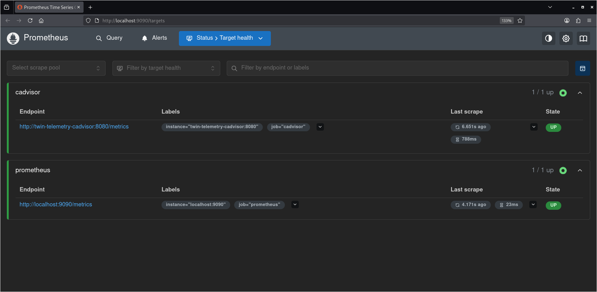
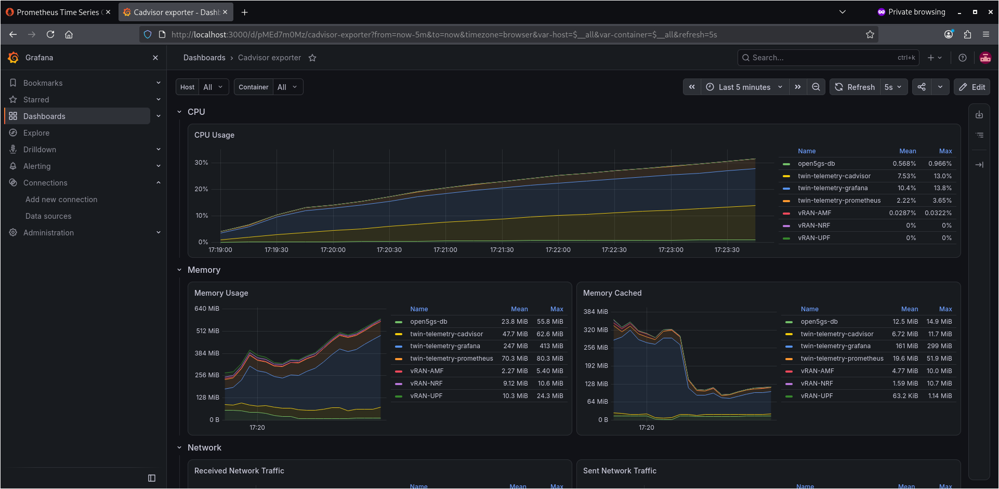
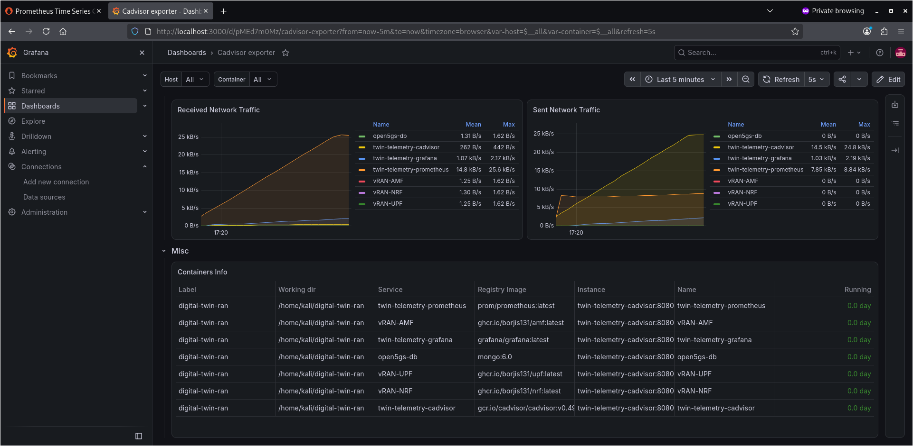

# Open5GS 5G Core Digital Twin & Telemetry Stack





## Architecture & Service Topology

The stack operates on a custom Docker bridge network (`ran_twin_net`: `10.45.0.0/16`) to isolate network functions and telemetry scrapers:

* **Open5GS Core Database (`open5gs-db`):** MongoDB 6.0 (`10.45.0.2`) serving as the central subscriber state registry.
* **Control Plane Functions:**
  * `vRAN-AMF` (`10.45.0.3`): Access and Mobility Management Function (`amd64`).
  * `vRAN-NRF` (`10.45.0.5`): Network Repository Function (`arm64` via QEMU emulation).
* **User Plane Function:**
  * `vRAN-UPF` (`10.45.0.4`): User Plane Function (`amd64`) with host TUN/TAP device binding.
* **Telemetry Pipeline:**
  * `twin-telemetry-cadvisor` (`10.45.0.12`): Real-time container resource collector.
  * `twin-telemetry-prometheus` (`10.45.0.10`): Time-series metrics scraper and storage engine.
  * `twin-telemetry-grafana` (`10.45.0.11`): Dashboard visualization interface.

## Technical Engineering & Remediation Highlights

1. **Multi-Architecture Execution (`arm64` on `x86_64`):** Resolved `exec format error` crashes on `vRAN-NRF` by registering host-level QEMU `binfmt_misc` handlers (`tonistiigi/binfmt`).
2. **Ephemeral File System Log Isolation:** Fixed Open5GS log file locking and startup aborts (`cannot open log file`) by mounting in-memory `tmpfs` file systems over `/open5gs/install/var/log/open5gs`.
3. **Host Kernel Routing Integration:** Bound `/dev/net/tun` with `NET_ADMIN` capabilities to enable packet processing for `vRAN-UPF`.
4. **Container DNS Service Discovery:** Configured cross-container scraping using static Docker network aliases (`http://twin-telemetry-prometheus:9090` and `twin-telemetry-cadvisor:8080`).

## Environment Prerequisites & Quick Start

Ensure host kernel modules and emulation handlers are active before starting the stack:

```bash
# 1. Register QEMU multi-architecture binary handlers
sudo docker run --privileged --rm tonistiigi/binfmt --install all

# 2. Load the host Linux kernel TUN module
sudo modprobe tun

# 3. Launch the complete digital twin stack
docker compose up -d
```

## Monitoring Interfaces

Grafana Dashboards: http://localhost:3000 (Default credentials: admin / admin)

Prometheus Target Health: http://localhost:9090/targets

cAdvisor Engine: http://localhost:8080
